# TestCase Generator — QA AI & Azure DevOps Suite

> Herramienta profesional de Aseguramiento de Calidad (QA) basada en Inteligencia Artificial. Se conecta a **Azure DevOps REST API** para consultar Historias de Usuario (PBIs), genera suites completas de casos de prueba con **Google Gemini IA** (flujos positivos, alternativos y escenarios BDD Gherkin automatizables) y crea automáticamente los Work Items de tipo **Test Case** vinculados al PBI padre.

---

## Tabla de Contenidos
1. [Características Principales](#-características-principales)
2. [Arquitectura Tecnológica](#-arquitectura-tecnológica)
3. [Estructura del Proyecto](#-estructura-del-proyecto)
4. [Requisitos Previos](#-requisitos-previos)
5. [Instalación y Puesta en Marcha](#-instalación-y-puesta-en-marcha)
6. [Guía de Configuración](#-guía-de-configuración)
   - [Configuración de Firebase Auth](#1-configuración-de-firebase-authentication)
   - [Configuración de Azure DevOps](#2-configuración-de-azure-devops)
   - [Configuración de Google Gemini IA](#3-configuración-de-google-gemini-ia)
7. [Flujo de Trabajo de la Aplicación](#-flujo-de-trabajo-de-la-aplicación)
8. [Solución de Problemas Frecuentes (Troubleshooting)](#-solución-de-problemas-frecuentes)
9. [Comandos del Proyecto](#-comandos-del-proyecto)

---

## 🚀 Características Principales

* **Integración Nativa con Azure DevOps REST API (v7.0):**
  * Consulta historias de usuario por ID numérico (`System.Title`, `System.Description`, `Microsoft.VSTS.Common.AcceptanceCriteria`).
  * Limpieza automática de formato HTML enriquecido a texto legible.
  * Creación en lote de Work Items de tipo `Test Case` usando formato estándar `application/json-patch+json`.
  * Conversión de pasos al formato XML oficial de Azure Test Runner (`Microsoft.VSTS.TCM.Steps`).
  * Vinculación jerárquica inversa automática (`System.LinkTypes.Hierarchy-Reverse`) para relacionar los Test Cases al PBI padre.

* **Motor Generativo con Google Gemini IA:**
  * Cobertura de pruebas bajo estándares **ISTQB**:
    * ✅ **Happy Path (Flujos Positivos):** Validación de caminos ideales.
    * ⚠️ **Flujos Alternativos y Casos de Borde:** Errores de validación, timeouts y excepciones de negocio.
    * 🥒 **BDD Gherkin Automatizable:** Escenarios estructurados en `Dado que / Cuando / Entonces` (*Given / When / Then*).
  * Salida forzada y estricta en JSON (`responseMimeType: "application/json"`).
  * Soporte para modelos de alta velocidad y razonamiento (`gemini-flash-latest`, `gemini-3.5-flash-lite`, `gemini-3.6-flash`).

* **Autenticación y Seguridad (Firebase):**
  * SDK modular de Firebase Authentication v10+.
  * Protección de rutas con Angular Functional Guard (`authGuard`).
  * Perfil de usuario dinámico (Nombre, Correo y Rol QA) desplegado en el Sidebar.
  * Modo de evaluación rápida (*Demo*) para pruebas inmediatas sin requerir consola activa de Firebase.

* **Diseño UI y Estilos (SCSS Modular):**
  * **Cero utilidades CSS externas:** SCSS puro organizado con variables de diseño (`_variables.scss`), mixins y metodología BEM.
  * Paleta oscura profesional para el Sidebar y Login (`#0B0F19`, `#111827`).
  * Área de trabajo clara y descansada (`#F9FAFB`) con cards en `#FFFFFF`, bordes sutiles y sombras suaves.
  * Tipografías optimizadas: **Inter** para la interfaz y **JetBrains Mono** para sintaxis de código Gherkin.

---

## 🛠 Arquitectura Tecnológica

| Componente | Tecnología | Propósito |
| :--- | :--- | :--- |
| **Framework Web** | Angular 19+ / 21 | Aplicación SPA moderna con Standalone Components |
| **Gestión de Estado** | Angular Signals (`signal`, `computed`) | Reactividad declarativa y síncrona |
| **Control Flow** | `@if`, `@for`, `@let` | Sintaxis nativa de control de flujo en plantillas |
| **Estilos** | SCSS (Dart Sass) | Variables globales, mixins, diseño responsivo |
| **Autenticación** | Firebase Authentication Web SDK | Inicio de sesión seguro con correo y contraseña |
| **Gestor de Pruebas** | Azure DevOps REST API v7.0 | Consulta de PBIs y persistencia de Test Cases |
| **Inteligencia Artificial**| Google Gemini REST API | Modelos generativos estructurados |
| **Empaquetado** | Vite / Angular Build (`@angular/build`) | Compilación de alto rendimiento |

---

## 📂 Estructura del Proyecto

```text
src/
├── app/
│   ├── core/                           # Servicios singleton, modelos y guardias
│   │   ├── guards/
│   │   │   └── auth.guard.ts           # Protección de rutas privadas (/dashboard, /settings)
│   │   ├── models/
│   │   │   ├── config.model.ts         # Tipos para Azure DevOps y Gemini
│   │   │   ├── pbi.model.ts            # Estructura del Product Backlog Item
│   │   │   ├── test-case.model.ts      # Estructura del caso de prueba y sync
│   │   │   └── user.model.ts           # Perfil de usuario QA
│   │   └── services/
│   │       ├── auth.service.ts         # Integración Firebase Auth y sesión local
│   │       ├── azure-devops.service.ts # Consultas, TCM XML y creación de Test Cases
│   │       ├── config.service.ts       # Persistencia en localStorage con Signals
│   │       └── gemini-ai.service.ts    # Prompting de QA y llamada a Gemini API
│   ├── features/                       # Vistas principales de la aplicación
│   │   ├── auth/                       # Pantalla de Login (Layout split 50/50)
│   │   │   ├── login.component.ts
│   │   │   ├── login.component.html
│   │   │   └── login.component.scss
│   │   ├── dashboard/                  # Generador principal con IA (3 columnas)
│   │   │   ├── dashboard.component.ts
│   │   │   ├── dashboard.component.html
│   │   │   └── dashboard.component.scss
│   │   └── settings/                   # Parámetros del sistema y prueba de conexiones
│   │       ├── settings.component.ts
│   │       ├── settings.component.html
│   │       └── settings.component.scss
│   ├── shared/
│   │   └── components/
│   │       └── sync-modal/             # Modal de confirmación tras sincronización
│   │           ├── sync-modal.component.ts
│   │           ├── sync-modal.component.html
│   │           └── sync-modal.component.scss
│   ├── app.routes.ts                   # Enrutamiento de la aplicación
│   ├── app.config.ts                   # Proveedores globales (Router, HttpClient withFetch)
│   ├── app.component.ts                # Contenedor raíz
│   └── app.component.html
├── environments/
│   ├── environment.ts                  # Variables de entorno (Producción)
│   └── environment.development.ts      # Variables de entorno (Desarrollo)
├── styles/
│   ├── _variables.scss                 # Tokens de color, tipografía, sombras y radios
│   ├── _mixins.scss                    # Utilidades de layout, superficies y botones
│   └── _reset.scss                     # Reset CSS moderno
└── styles.scss                         # Estilos globales y fuentes de Google
```

---

## 📋 Requisitos Previos

Antes de ejecutar el proyecto, asegúrate de contar con:

1. **Node.js**: Versión `v18.19.0` o superior (probado con `v20.x` y `v24.x`).
2. **NPM**: Versión `9.x` o superior.
3. **Personal Access Token (PAT) de Azure DevOps**:
   * Token generado en `https://dev.azure.com/{tu-organizacion}/_usersSettings/tokens`.
   * Alcance (*Scopes*): **Work Items** (Lectura y Escritura: `Read & Write`) y **Project & Team** (`Read`).
4. **Google Gemini API Key**:
   * Obtenida gratuitamente en [Google AI Studio](https://aistudio.google.com/).

---

## 💻 Instalación y Puesta en Marcha

1. **Clonar el repositorio:**
   ```bash
   git clone https://github.com/tu-usuario/TestCaseGenerator-Angular.git
   cd TestCaseGenerator-Angular
   ```

2. **Instalar dependencias:**
   ```bash
   npm install
   ```

3. **Iniciar el servidor de desarrollo:**
   ```bash
   npm start
   ```

4. **Abrir en el navegador:**
   Navega a `http://localhost:4200/`.

---

## ⚙️ Guía de Configuración

### 1. Configuración de Firebase Authentication
Si vas a utilizar autenticación real con tu propio proyecto de Firebase, edita los archivos [environment.development.ts](file:///c:/Users/diego/Documentos/Developer/TestCaseGeneratorAngular/src/environments/environment.development.ts) y [environment.ts](file:///c:/Users/diego/Documentos/Developer/TestCaseGeneratorAngular/src/environments/environment.ts):

```typescript
export const environment = {
  production: false,
  firebase: {
    apiKey: "AIzaSyTuClaveRealDeFirebase...",
    authDomain: "tu-proyecto.firebaseapp.com",
    projectId: "tu-proyecto",
    storageBucket: "tu-proyecto.appspot.com",
    messagingSenderId: "1234567890",
    appId: "1:1234567890:web:abcdef..."
  }
};
```
> **Nota:** Si dejas las claves por defecto, la aplicación habilitará de forma transparente el **modo Demo/Offline**, permitiendo iniciar sesión inmediatamente con cualquier correo o mediante el botón *"Autocompletar credenciales"*.

### 2. Configuración de Azure DevOps
Desde la pantalla **Parámetros del Sistema** (`/settings`):
* **Organización:** Nombre que aparece en la URL de tu Azure DevOps (ejemplo: si la URL es `https://dev.azure.com/mi-empresa`, ingresa `mi-empresa`).
* **Nombre del Proyecto:** Nombre exacto del proyecto donde residen los PBIs (ej: `Core-Banking-QA` o `CMI`).
* **Personal Access Token (PAT):** El token secreto con permisos de lectura y escritura en Work Items.
* Presiona **"Probar Conexión Azure DevOps"** para verificar el acceso.

### 3. Configuración de Google Gemini IA
Desde la misma pantalla (`/settings`):
* **Gemini API Key:** Pega tu clave de API generada en Google AI Studio (inicia por `AQ...` o `AIza...`).
* **Modelo Generativo:** Selecciona **`Gemini Flash (Última versión - Recomendado)`** (`gemini-flash-latest`) o **`Gemini 3.5 Flash Lite`**.
* Presiona **"Probar Conexión Gemini IA"**.

---

## 🔄 Flujo de Trabajo de la Aplicación

```mermaid
flowchart LR
    A[Login / Demo] --> B[Dashboard]
    B --> C[Buscar PBI por ID]
    C -->|Azure DevOps REST| D[Autocompletar Título, Descripción y Criterios]
    D --> E[Generar Test Cases con IA]
    E -->|Google Gemini| F[Revisar y Seleccionar Casos de Prueba]
    F --> G[Enviar a Azure DevOps]
    G -->|Creación Work Items| H[Modal de Confirmación con Enlaces Directos]
```



1. **Autenticación (`/login`):** Accede con tus credenciales institucionales o haz clic en *"Autocompletar credenciales"*.
2. **Vincular Historia de Usuario (`/dashboard`):** Ingresa el ID del PBI (ej. `1042`) y presiona **"Buscar"**. Si no tienes un PBI a mano, presiona **"Cargar Ejemplo"** para cargar una historia representativa de pasarelas de pago.
3. **Generar con IA:** Haz clic en **"Generar Test Case con IA"**. Gemini analizará los criterios de aceptación y construirá los casos de prueba.
4. **Revisión y Ajuste:** Visualiza cada caso de prueba con sus pasos numerados, precondiciones, resultado esperado y etiqueta BDD Gherkin. Puedes seleccionar/deseleccionar los que desees sincronizar.
5. **Sincronización:** Haz clic en **"Enviar a Azure DevOps"**. Se crearán como Work Items reales y se abrirá el modal de éxito con los enlaces directos a Azure.

---

## 🔧 Solución de Problemas Frecuentes

### 1. Error `404 Not Found` en Azure DevOps al probar conexión
* **Causa:** El nombre de la organización o del proyecto no coincide exactamente con la URL de tu Azure DevOps, o el proyecto se estaba duplicando en la ruta.
* **Solución:** Asegúrate de ingresar solo el nombre simple (ej: `limited-proyects` en organización y `CMI` en proyecto). El endpoint consultado es `https://dev.azure.com/{organizacion}/_apis/projects/{proyecto}?api-version=7.0`.

### 2. Error `401 Unauthorized` / `203 Non-Authoritative Information`
* **Causa:** El PAT ha expirado o no tiene permisos suficientes.
* **Solución:** Genera un nuevo PAT en Azure DevOps con el alcance **Work Items: Read & Write**.

### 3. Error `404 Not Found` en Google Gemini al seleccionar `Gemini 1.5 Pro`
* **Causa:** Google ha deprecado los modelos 1.5 y 2.5 antiguos para cuentas y proyectos nuevos, respondiendo *"This model is no longer available to new users"*.
* **Solución:** Selecciona en el desplegable el modelo **`Gemini Flash (Última versión - Recomendado)`** (`gemini-flash-latest`) o **`Gemini 3.5 Flash Lite`**.

### 4. Bloqueo de Scripts en PowerShell en Windows (`PSSecurityException`)
* Si al ejecutar comandos como `npm` en PowerShell de Windows aparece un error de política de ejecución:
  ```powershell
  Set-ExecutionPolicy -Scope CurrentUser -ExecutionPolicy RemoteSigned
  ```
  O ejecuta el comando utilizando `npm.cmd start` / `ng.cmd serve`.

---

## 📦 Comandos del Proyecto

| Comando | Descripción |
| :--- | :--- |
| `npm start` | Inicia el servidor de desarrollo local en `http://localhost:4200/` con recarga automática. |
| `npm run build` | Compila la aplicación para producción en la carpeta `dist/`. |
| `npm run watch` | Compila en modo desarrollo observando cambios de archivos. |
| `npm test` | Ejecuta las pruebas unitarias del proyecto con Vitest. |

---

## 📄 Licencia y Créditos
Desarrollado como solución integral de QA Automation por el equipo de ingeniería. Potenciado por **Angular**, **Firebase**, **Azure DevOps** y **Google Gemini IA**.
